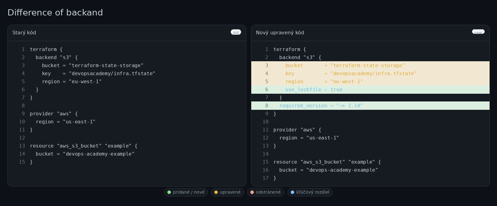

# Task B – Terraform Error: `Error locking state`

This task is about a Terraform setup that uses an S3 backend and returns the error `Error locking state`.

## What is the problem?

Terraform state is a shared file that keeps track of infrastructure resources.

When Terraform wants to update the state, it first tries to lock it.  
This is done so that two people or two pipelines do not change the same infrastructure at the same time.

The error usually happens because:
- someone else is already running Terraform against the same state,
- a previous run failed and left a stale lock,
- or the backend setup is not safe enough for team usage.

The original backend looks like this:

```hcl
terraform {
  backend "s3" {
    bucket = "terraform-state-storage"
    key    = "devopsacademy/infra.tfstate"
    region = "eu-west-1"
  }
}
```

This stores the state remotely, but it is still missing a better locking setup.

---

## Short-term fix

First, check if another Terraform run is already using the same state.

If yes:
- do not ignore the lock,
- wait for the other run to finish,
- or stop the wrong pipeline/job.

If the lock is stale, it can be removed with `terraform force-unlock`, but only after making sure nobody else is currently using the same state.

Example:

```bash
terraform init -reconfigure
terraform plan

# use only if the lock is stale
terraform force-unlock <LOCK_ID>

terraform plan
```

---

## Long-term fix

The safer long-term fix is to improve the backend configuration.

### Základná odporúčaná konfigurácia je:



Updated example:

```hcl
terraform {
  backend "s3" {
    bucket       = "terraform-state-storage"
    key          = "devopsacademy/infra.tfstate"
    region       = "eu-west-1"
    use_lockfile = true
  }

  required_version = "~> 1.14"
}
```

### Why this is better

- `use_lockfile = true` adds safer locking for the S3 backend
- `required_version` makes the Terraform version clear (I added required_version = "~> 1.14" more as a best practice than as a direct fix for the locking error. The ~> 1.14 syntax means the configuration expects Terraform from the 1.14.x line; a newer incompatible major/minor line would not pass.)
- the backend is better prepared for team collaboration

I would also add:
- S3 bucket versioning
- least-privilege IAM permissions
- separate state for each environment (`dev`, `stage`, `prod`)

The assignment also mentions DynamoDB as an example of a longer-term fix. That is valid too, especially in older Terraform setups.

---

## Team-safe workflow

To make Terraform safer for a team, I would use these rules:

### 1. Use remote state
Shared environments should not use local state files.

### 2. Run apply through CI/CD
For shared environments, `terraform apply` should run through a pipeline, not from many local laptops.

### 3. Separate plan and apply
Example:

```bash
terraform init -input=false
terraform plan -out=tfplan -input=false
terraform apply -input=false tfplan
```

### 4. Only one apply at a time
Only one pipeline should be allowed to run `apply` against the same state.

### 5. Separate environments
Each environment should have its own state file, for example:
- `devopsacademy/dev/infra.tfstate`
- `devopsacademy/stage/infra.tfstate`
- `devopsacademy/prod/infra.tfstate`

### 6. Re-run init after backend changes
If the backend changes, run:

```bash
terraform init -reconfigure
```

---

## Final answer

`Error locking state` happens because Terraform cannot safely lock the shared state file.

Short-term, I would check whether the lock is real or stale and recover carefully.  
Long-term, I would improve the backend, add safer locking, and make sure the team uses a workflow that prevents parallel changes to the same Terraform state.

This makes the setup safer, cleaner, and more realistic for production use.
